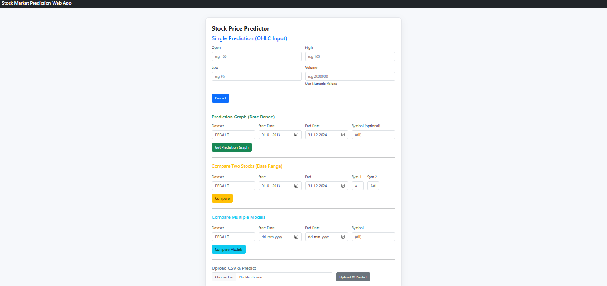
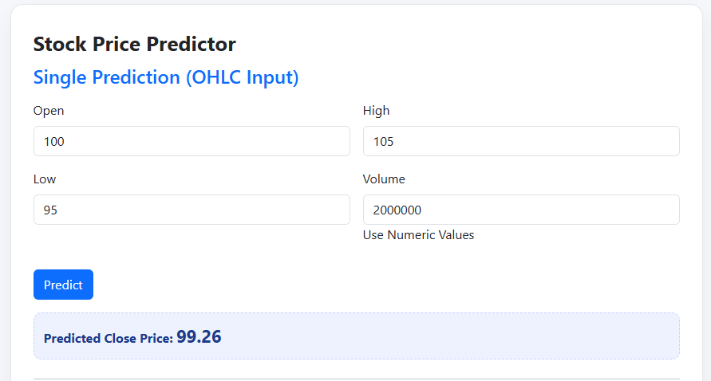
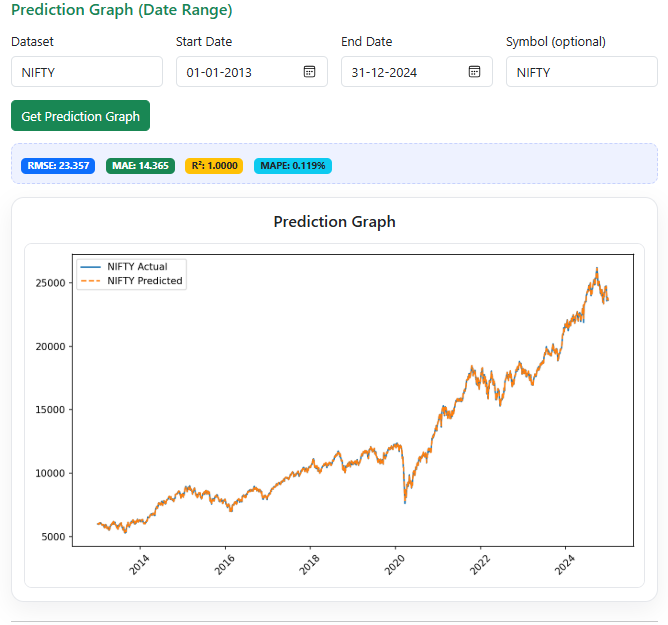
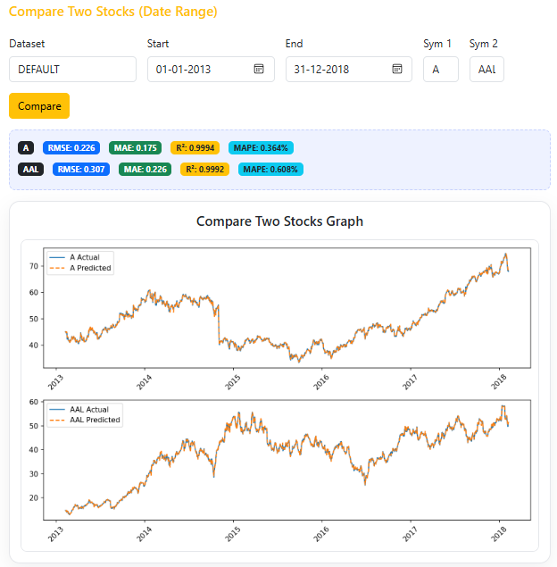
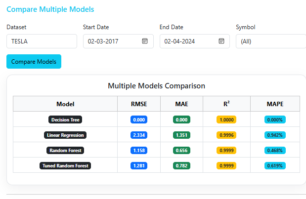
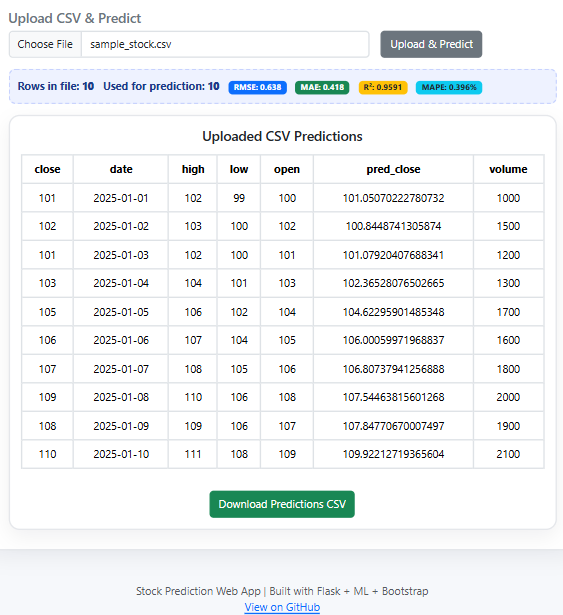

# 📈 Stock Market Prediction Web App

A machine learning powered web application to predict stock market closing prices.

---

## 🚀 Features
- Point prediction from OHLC values
- Prediction graph for selected date ranges
- Compare two stocks in one graph
- Compare multiple ML models (Linear, Decision Tree, Random Forest, Tuned RF)
- Upload CSV and get predictions with metrics
- Evaluation Metrics: RMSE, MAE, R², MAPE

---

## 🛠 Tech Stack
- *Frontend*: HTML, CSS (Bootstrap), JavaScript
- *Backend*: Python (Flask)
- *ML Models*: Scikit-learn (LR, DT, RF)
- *Visualization*: Matplotlib
- *Data*: Historical stock datasets (CSV)

---

### Screenshots  

#### 🏠 Home Page


#### 📈 Single Prediction


#### 📊 Prediction Graph


#### 🔀 Compare Two Stocks


#### 🤖 Compare Models


#### 📂 Upload CSV


## ⚙ How to Run
```bash
# Clone repo
git clone https://github.com/Manas5650/StockMarketML.git
cd StockMarketML

# Create virtual environment
python -m venv venv
source venv/bin/activate  # (Windows: venv\Scripts\activate)

# Install dependencies
pip install -r requirements.txt

# Run Flask app
python app.py
